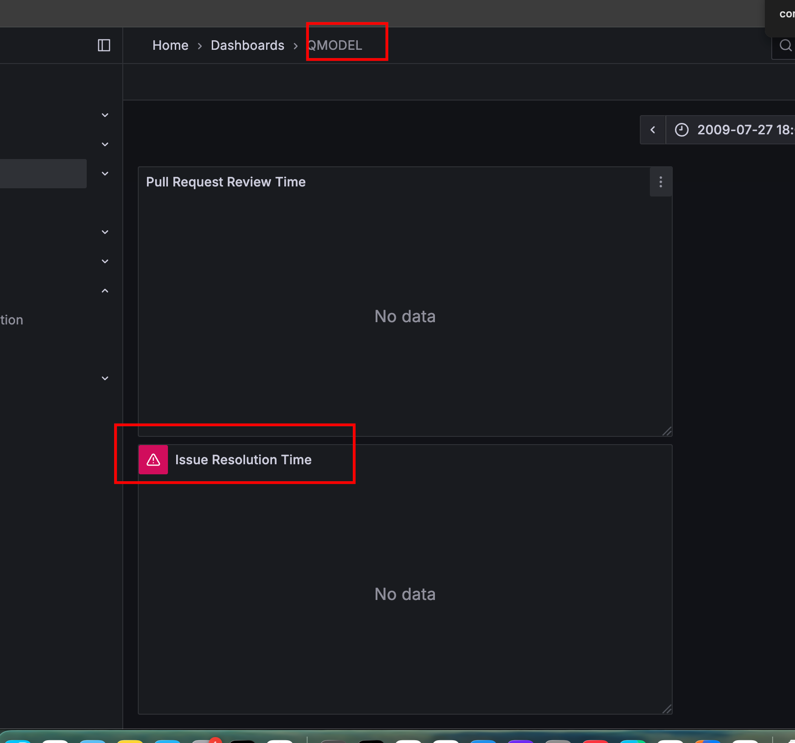
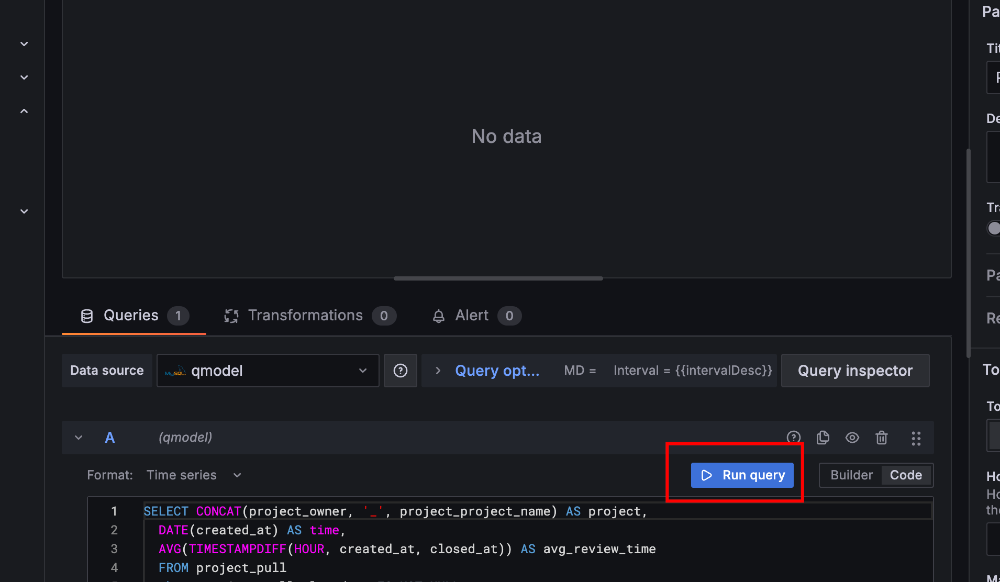

= QModel: Docker Setup & API Guide
:doctype: book
:toc:
:toclevels: 3
:sectnums:
:source-highlighter: highlightjs
:icons: font
:experimental:

QModel is a service and dashboard toolkit to collect, persist, and analyze software-quality signals from public GitHub repositories.
It ingests repository metadata (commits, issues, pull requests, Actions runs), computes commit-graph metrics, links defects with an SZZ-style tracer, stores everything in MySQL, and exposes REST endpoints that power Grafana dashboards and offline analyses.

---

== Requirements

Before installation, ensure you have the following components installed on your system:

[cols="1,3",options="header"]
|===
| Requirement | Description

| **Docker** | Required to run containerized services.
Install from: https://docs.docker.com/get-docker/

| **Docker Compose** | Used to orchestrate multiple containers (QModel, MySQL, Grafana).
Install from: https://docs.docker.com/compose/install/

| **GitHub Personal Access Token (PAT)** | Required to access GitHub’s REST API.
Generate from: https://github.com/settings/tokens
Select `repo` or `public_repo` scopes (depending on access).
Use multiple tokens (comma-separated) for better rate-limit handling.

| **Free disk space** | At least **5–10 GB** depending on repository size and history depth.

| **Internet access** | QModel fetches live data from GitHub; ensure outbound HTTPS is allowed.

| **Ports** |
8082 → QModel API
3001 → Grafana Dashboard
3306 → MySQL database (container-internal by default)

| **Memory** | Minimum **2 GB RAM** (4 GB recommended for large imports).
Ensure Docker Desktop or daemon is configured with adequate memory.

|===

---

== Installation

To run QModel with **Docker Compose**, follow these steps:

[source,bash]
----
echo "QModel, Grafana, and MySQL are now running. Access them at:"
echo "QModel API: http://localhost:8082"
echo "Grafana:    http://localhost:3001  (admin/admin)"
echo "Downloading docker-compose.yml from GitHub..."
curl -L https://raw.githubusercontent.com/dimmonn/qmodel/refs/heads/main/docker-compose.yml -o docker-compose.yml

echo "Creating the qmodel-secret.properties file..."
if [ ! -f "qmodel-secret.properties" ]; then
  touch qmodel-secret.properties
  # Modify to include your token `Bearer ghp_xxx` if you want to make 1K+ queries
  echo "qmodel.api.key=" > qmodel-secret.properties
fi

echo "Starting services using Docker Compose..."
docker-compose up
----

Navigate to the **QMODEL** data source in Grafana and execute an initial query so tables are created/populated (dashboards may be empty until data arrives).

http://localhost:3001/d/adj5g9c/qmodel?orgId=1&from=2009-07-27T16:07:42.199Z&to=2026-04-24T07:03:58.581Z&timezone=browser

Make sure you run a query like in the example below (dashboards might not auto-load the first time):

---

== Introduction

QModel integrates several modular services:

* a **collector** that calls GitHub REST v3 endpoints with token rotation and paging,
* a **persistence layer** (Spring Boot JPA/Hibernate to MySQL),
* a **graph engine** computing per-commit DAG metrics (branch reach, FP-segment distance, merges, etc.),
* a **defect linker** (SZZ-style) connecting closed issues to bug-fixing and candidate bug-introducing commits,
* a **REST API** to trigger and monitor imports,
* and **Grafana dashboards** for visual and exploratory analysis.

Its purpose is to provide **reproducible, time-aware software quality metrics**:
collect once, persist in a relational schema, analyze anytime.

---

== Features

* **Ingests** commits, file changes, issues, pull requests, and Actions runs.
* **Persists** data into MySQL with well-defined entity relations.
* **Computes** advanced graph metrics for each commit:
- in/out degree
- min/max depth
- branch reachability
- FP-segment start distance
- merge frequency
- upstream branch merges
- time since last merge
* **Links** defects using SZZ methodology (fixing ↔ introducing commits).
* **Provides** RESTful endpoints for automation and dashboard integration.
* **Supports** demo vs production modes for small or large-scale runs.
* **Visualizes** results in Grafana dashboards via SQL queries.

---

== Quick Start (Docker Compose)

. Start the stack using the previous installation steps.
. Verify `qmodel-secret.properties` includes:
+
[source,properties]
----
qmodel.api.key=Bearer ghp_xxx,Bearer ghp_yyy
app.mode=prod
app.page_size=100
----
. Visit **QModel API** → http://localhost:8082
. Visit **Grafana Dashboard** → http://localhost:3001 (admin/admin).
. Run one of the example API calls below to begin ingestion.

---

== Configuration

QModel reads its configuration from `qmodel-secret.properties` and/or environment variables.

[cols="2,1,5",options="header"]
|===
| Key | Default | Description

| `qmodel.api.key`
| —
| **Comma-separated** GitHub tokens. *Each token must include* the `Bearer ` prefix (e.g., `Bearer ghp_xxx`). QModel rotates tokens automatically on rate limit or error.

| `app.mode`
| `prod`
| Defines operating mode. `prod` follows GitHub pagination fully; `demo` limits pages and rows for testing.

| `app.page_size`
| `100`
| Number of records requested per API page (max 100 allowed by GitHub REST v3).

| `app.demo_max_pages`
| `3`
| Maximum pages to fetch in demo mode.

| `app.demo_max_rows`
| `1500`
| Maximum total rows in demo mode.

| `app.hard_max_pages`
| `100000`
| Safety limit on pages fetched in prod mode to prevent infinite loops.

| `app.base_url`
| `https://api.github.com/`
| Base API endpoint for GitHub REST v3.
|===

---

== Running the Application

* **Import data** by calling the API (see <<example-requests,Example Requests>>).
* **Build the graph** after commit import: `/api/graph/data`.
* **Explore data** via Grafana dashboards or SQL queries.

---

== Stopping Services

[source,bash]
----
docker-compose down

docker-compose down -v
----

---

== Troubleshooting

* **401/403 or rate limits:** Ensure tokens are correct, prefixed with `Bearer `, and multiple tokens are configured.
* **Slow imports / OOM:** Use streaming mode; data flushes in batches automatically.
* **Empty dashboards:** Run at least one data import; refresh Grafana after MySQL tables populate.
* **SZZ orphan commits:** The tracer fetches missing commits and checks out temp branches automatically.

---

== API Reference

*Base path:* `/api/v1/metrics`
*Graph endpoint:* `/api/graph/data`

Each API endpoint triggers collection or computation steps and persists to the database.

=== Repository Catalog
* **GET** `/api/v1/metrics/repos` — list imported projects.

=== Commits
* **GET** `/api/v1/metrics/repos/{owner}/{repo}/commits` — stream commit history into DB.
* **GET** `/api/v1/metrics/repos/{owner}/{repo}/commits/{sha}` — import a single commit by SHA.

=== Pull Requests
* **GET** `/api/v1/metrics/repos/{owner}/{repo}/pulls` — import all closed PRs and metadata.

=== Issues
* **GET** `/api/v1/metrics/repos/{owner}/{repo}/issues` — fetch closed issues.
* **DELETE** `/api/v1/metrics/repos/{owner}/{repo}/issues` — remove all issues for a project.

=== Actions
* **GET** `/api/v1/metrics/repos/{owner}/{repo}/actions` — import GitHub Actions workflow runs.

=== Forks
* **GET** `/api/v1/metrics/repos/{owner}/{repo}/forked` — merge fork tip commits into project snapshot.
* **GET** `/api/v1/metrics/repos/{owner}/{repo}/forks` — compute local fork differences.

=== Graph Metrics (DAG)
* **GET** `/api/graph/data?owner={owner}&repo={repo}` — compute and persist commit graph metrics:
- in/out degree
- min/max depth
- merge_count
- number_of_branches
- average_degree
- distance_to_branch_start
- upstream_heads_unique_on_segment
- days_since_last_merge_on_segment

=== SZZ Defect Linking
* **GET** `/api/v1/metrics/repos/{owner}/{repo}/retrieveFixingCommits` — attach bug-fixing commits.
* **GET** `/api/v1/metrics/repos/{owner}/{repo}/{id}/retrieveBugIntroducingCommits` — trace candidate introducers for a given issue.
* **GET** `/api/v1/metrics/repos/{owner}/{repo}/retrieveBugIntroducingCommits?depth={d}` — full-repo SZZ scan (depth optional).

---

== Example Requests

[source,bash]
----
curl --request GET \
  --url http://localhost:8082/api/v1/metrics/repos/ansible/ansible/issues

curl --request GET \
  --url http://localhost:8082/api/v1/metrics/repos/ansible/ansible/pulls

curl --request GET \
  --url http://localhost:8082/api/v1/metrics/repos/ansible/ansible/commits

curl --request GET \
  --url http://localhost:8082/api/v1/metrics/repos/google/guava/commits/1ec90b045a45b4603ea5bd1c296f284ec1c438db

curl --request GET \
  --url http://localhost:8082/api/v1/metrics/repos/ansible/ansible/forked

curl --request GET \
  --url 'http://localhost:8082/api/graph/data?owner=ansible&repo=ansible'

curl --request GET \
  --url http://localhost:8082/api/v1/metrics/repos/ansible/ansible/retrieveBugIntroducingCommits

curl --request GET \
  --url http://localhost:8082/api/v1/metrics/repos/ansible/ansible/retrieveFixingCommits
----

---

== Data Model (Simplified)

[cols="2,5",options="header"]
|===
| Table | Description

| `project`
| Project definition (owner, name).

| `agraph`
| Commit graph snapshot per project.

| `commit`
| Stores commit metadata, author info, timestamps, and graph metrics.

| `file_change`, `commit_file_changes`
| File-level change sets with patch diffs and line counts.

| `project_pull`
| Pull request metadata (assignees, reviewers, linked commits).

| `project_issue`
| Issues, labels, and SZZ links to fixing/introducing commits.

| `project_issue_fixing_commits`
| PR commits that closed the issue.

| `project_issue_bug_introducing_commits`
| Candidate commits that introduced the bug.
|===

---

== Dashboard SQL Examples

**Commits per week**

[source,sql]
----
SELECT DATE_FORMAT(c.commit_date, '%Y-%u') AS week, COUNT(*) AS commits
FROM commit c
WHERE c.project_owner = 'ansible' AND c.project_name = 'ansible'
GROUP BY week
ORDER BY week;
----

**Average PR review time by month**

[source,sql]
----
SELECT DATE_FORMAT(p.created_at, '%Y-%m') AS ym,
       AVG(TIMESTAMPDIFF(HOUR, p.created_at, p.merged_at)) AS avg_review_hours
FROM project_pull p
WHERE p.project_owner='ansible' AND p.project_name='ansible'
  AND p.state='closed' AND p.merged_at IS NOT NULL
GROUP BY ym
ORDER BY ym;
----

**Graph complexity vs PR review time**

[source,sql]
----
SELECT AVG(c.max_depth_of_commit_history) AS avg_max_depth,
       AVG(TIMESTAMPDIFF(HOUR, p.created_at, p.merged_at)) AS avg_review_hours
FROM project_pull p
JOIN project_pull_commits pc
  ON pc.project_pull_id = p.id
 AND pc.project_pull_project_owner = p.project_owner
 AND pc.project_pull_project_name = p.project_name
JOIN commit c ON c.sha = pc.commits_sha
WHERE p.project_owner='ansible' AND p.project_name='ansible'
  AND p.state='closed' AND p.merged_at IS NOT NULL;
----

**SZZ: Time to fix vs introducer metrics**

[source,sql]
----
SELECT AVG(TIMESTAMPDIFF(DAY, i.created_at, i.closed_at)) AS avg_days_to_close,
       AVG(ci.max_depth_of_commit_history)                AS avg_depth_intro,
       AVG(cf.max_depth_of_commit_history)                AS avg_depth_fix
FROM project_issue i
JOIN project_issue_bug_introducing_commits ib
  ON ib.project_issue_id = i.id
JOIN commit ci ON ci.sha = ib.bug_introducing_commits_sha
JOIN project_issue_fixing_commits ifc
  ON ifc.project_issue_id = i.id
JOIN commit cf ON cf.sha = ifc.fixing_commits_sha
WHERE i.project_owner='ansible' AND i.project_name='ansible'
  AND i.state='closed' AND i.closed_at IS NOT NULL;
----

---

== Contributing

* **Report issues and PRs:** via the official GitHub repository.
* **Code style:** Standard Spring Boot + JPA guidelines; keep SQL compatible with MySQL 8.
* **Dashboards:** Contributions of Grafana dashboards and example SQL are welcome.

---

== License

This project is open source and available under the repository license.
