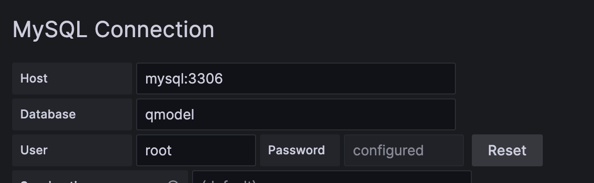

# QModel

App visualises software quality metrics for a given github project  

## Table of Contents

- [Installation](#installation)
- [Usage](#usage)
- [Contributing](#contributing)
- [License](#license)

## Installation

1. `mvn clean install`
2. `docker-compose up`
3. http://localhost:3000
4. configure connector

5. configure visualization
- Issue Resolution Time:
  `SELECT CONCAT(project_owner, ':', project_project_name) AS project,
  DATE(created_at) AS time,
  AVG(TIMESTAMPDIFF(HOUR, created_at, closed_at)) AS avg_review_time
  FROM project_issue
  where project_issue.closed_at IS NOT NULL
  GROUP BY project_owner, project_project_name, time
  ORDER BY time ASC;`
- Pull Request Review Time
  `SELECT CONCAT(project_owner, '_', project_project_name) AS project,
  DATE(created_at) AS time,
  AVG(TIMESTAMPDIFF(HOUR, created_at, closed_at)) AS avg_review_time
  FROM project_pull
  where project_pull.closed_at IS NOT NULL
  GROUP BY project_owner, project_project_name, time
  ORDER BY time ASC;`
- Commit Activity Over Time
  `SELECT CONCAT(p.owner, '_', p.project_name) AS project,
  DATE(c.commit_date) AS time,
  COUNT(c.id) AS commitCount
  FROM commit c
  JOIN agraph ag ON c.a_graph_id = ag.id
  JOIN project p ON p.owner = ag.repo_owner AND p.project_name = ag.repo_project_name
  GROUP BY p.owner, p.project_name, time
  ORDER BY time ASC`
## Usage

`GET http://localhost:8080/api/v1/metrics/repos/{repo_owner}/{repo_name}`
`GET http://localhost:8080/api/v1/metrics/repos/{repo_owner}/{repo_name}/pulls`
`GET http://localhost:8080/api/v1/metrics/repos/{repo_owner}/{repo_name}/issues`

`GET http://localhost:8080/api/v1/metrics/repos/ag`
`GET http://localhost:8080/api/v1/metrics/repos/pulls`
`GET http://localhost:8080/api/v1/metrics/repos/fixtime`
payload
`[
{
"owner": "XXXXX",
"projectName": "XXXXX"
}, {
"owner": "XXXXX",
"projectName": "XXXXX"
}
]`

## Contributing

anytime

## License

n/a